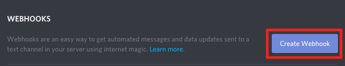
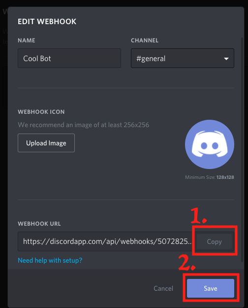

# Twitter-to-Discord-WebHooks
Middleware application that monitors Twitter accounts and sends new posts to discord webhook endpoints

## 1. Setting up

1. Install [NodeJS](https://nodejs.org).
2. Install project requirements. (Run `npm i twit request` in terminal/cmd)
3. Collect your Twitter API keys from [Twitter Developer](https://dev.twitter.com).
4. Put your Twitter API keys in app.js where noted by comments.

## 2. Getting the WebHook URL
1. On a Discord server where you have admin rights, hover over the channel you want the webhook for, and click the cog.

2. After clicking on the cog icon, click the "Webhooks" option on the side panel.

3. In the webhooks menu, locate and click the "Create Webhook" button.

4. In the popup that appears, copy your webhook URL, then hit save.

5. Get your WebHook from discord and put it where noted by comments.

## Starting it
Once all of this is finished, and you've configured the script, open terminal/cmd to the folder where app.js is stored, and run `node app.js` to start.
